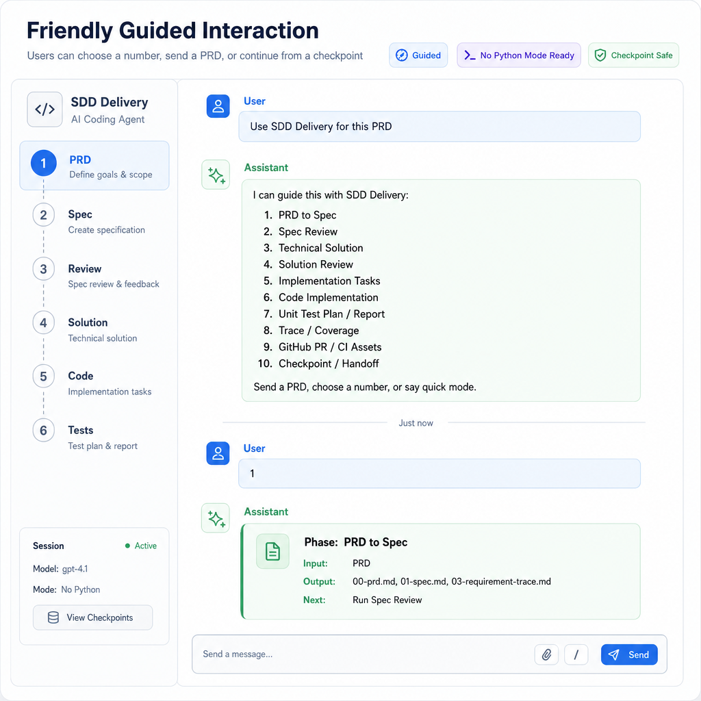

# SDD Delivery Skill

[中文](#中文说明) | [English](#english)

## 中文说明

SDD Delivery 是一个面向 AI 编程助手的 Spec-first 研发交付技能。安装后，用户不需要记脚本命令，只需要发送 PRD 或选择阶段，AI 就会按流程生成和维护交付产物。

## 如何安装

复制当前 skill 目录到 Codex skills 目录：

```bash
cp -R sdd-delivery ~/.codex/skills/sdd-delivery
```

Windows 可以复制到：

```text
%USERPROFILE%\.codex\skills\sdd-delivery
```

如果通过 Codex 插件市场安装，推荐使用：

```text
/plugin marketplace add codepunk-gm/sdd-delivery-skill
/plugin install sdd-delivery
```

## 如何使用

在 Codex 中输入：

```text
使用 sdd-delivery，基于这个 PRD 生成 Spec、技术方案、审查清单、实现任务、单测计划和可观测交付产物。
```

启动后发送 PRD，或选择阶段：

```text
1. PRD 转 Spec    2. 需求澄清      3. Spec 审查     4. 一致性分析
5. 技术方案        6. 方案审查      7. 任务拆分      8. 代码实现
9. 单测            10. 交付审查     11. 检查点 / 交接

请发送 PRD，或回复编号继续。
```

## 视觉概览




## 核心能力

1. PRD 转 Spec — 将 PRD 解析为可审查的 Spec 和需求追踪矩阵
2. 需求澄清 — 10 类歧义扫描，每轮最多 5 个问题
3. Spec 审查 — 完整性、可测试性、边界检查
4. 一致性分析 — 四遍交叉产物一致性检查
5. 技术方案 — 基于 repo 证据的方案设计 + 事前验尸
6. 方案审查 — 架构、兼容性、安全、性能、回滚审查
7. 任务拆分 — 带边界标注的可追踪任务拆分
8. 代码实现 — TDD 驱动、逐任务审查、实现日志
9. 单测 — 单测计划 + 单测报告 + SPEC-* 反查覆盖
10. 交付审查 — 边界验证、追踪覆盖、安全审计
11. 检查点 / 交接 — 结构化状态保存，支持中断恢复

## 无 Python 模式

Python 不是使用前提。没有 Python 时，AI 应直接手动创建和更新 Markdown / JSON 产物，并说明哪些自动化步骤被跳过。

## 可选脚本

有 Python 时，可以使用脚本加速：

```bash
python scripts/init_artifacts.py login-rate-limit
python scripts/parse_prd_to_spec.py prd.md .sdd-delivery/login-rate-limit --force
python scripts/trace_coverage.py .sdd-delivery/login-rate-limit
python scripts/scan_test_coverage.py . .sdd-delivery/login-rate-limit --update-report --update-trace
python scripts/sync_observability.py .sdd-delivery/login-rate-limit
python scripts/validate_artifacts.py .sdd-delivery/login-rate-limit
```

## 设计参考

本技能参考了 GitHub Spec Kit 的 Spec-first 阶段化流程、OpenSpec 的 brownfield 变更思路、Agent Skill 的渐进加载模式、checkpoint 上下文恢复实践、需求追踪矩阵，以及 GitHub PR / CI 交付实践。详细说明见：`references/open-source-influences.md`。
## English

SDD Delivery is a Spec-first delivery skill for AI coding agents. Users do not need to remember script commands. They can send a PRD or choose a workflow stage, and the agent maintains the delivery artifacts.

## Installation

To install through the Codex plugin marketplace:

```text
/plugin marketplace add codepunk-gm/sdd-delivery-skill
/plugin install sdd-delivery
```

Or copy this skill directory into Codex skills:

```bash
cp -R sdd-delivery ~/.codex/skills/sdd-delivery
```

## Usage

```text
Use $sdd-delivery to turn this PRD into Spec, solution, reviewed implementation tasks, unit tests, and observable delivery artifacts.
```

Recommended menu:

```text
SDD Delivery stages:
1. PRD to Spec   2. Clarify       3. Spec Review   4. Analyze
5. Solution      6. Solution Rev  7. Task Split    8. Implement
9. Unit Test     10. Delivery Rev 11. Checkpoint

Send a PRD or reply with a number.
```

## Optional Scripts

Scripts are optional accelerators:

```bash
python scripts/init_artifacts.py login-rate-limit
python scripts/parse_prd_to_spec.py prd.md .sdd-delivery/login-rate-limit --force
python scripts/validate_artifacts.py .sdd-delivery/login-rate-limit
```


## Design References

This skill references GitHub Spec Kit for Spec-first phased delivery, OpenSpec for brownfield-friendly changes, Agent Skill progressive disclosure, checkpoint-based recovery, requirement traceability, and GitHub PR / CI delivery practices. See `references/open-source-influences.md` for details.

