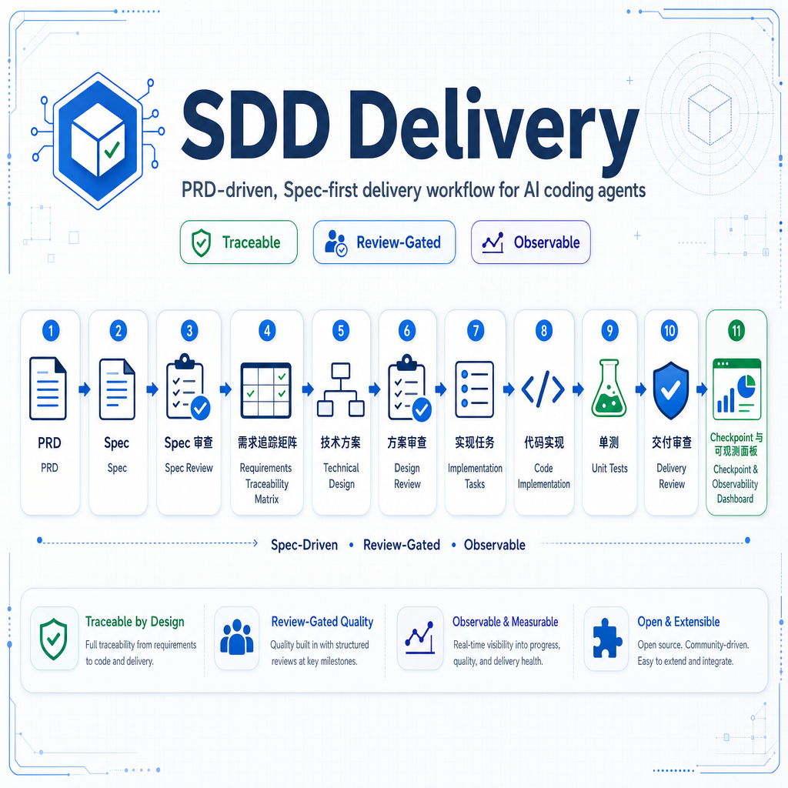
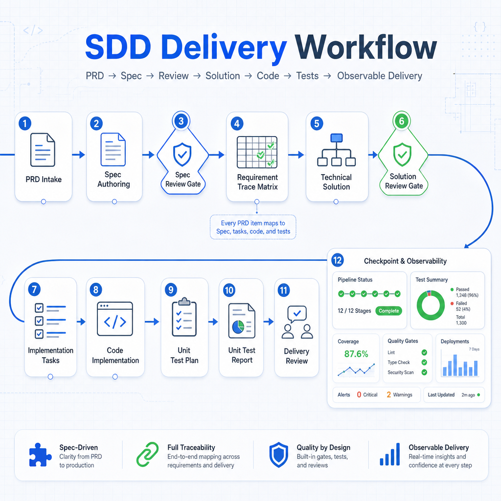

# SDD Delivery Skill

[中文](#中文说明) | [English](#english)

## 中文说明

SDD Delivery 是一个面向 AI 编程助手的 Spec-first 研发交付技能。它把 PRD 先整理成可审查的 Spec，再推进到技术方案、方案审查、实现任务、代码实现、单测计划、单测报告、交付审查，以及可恢复的检查点和可观测面板。

## 视觉概览






## 核心能力

- **Spec 前置**：PRD 先转成 Spec，再进入评审和技术方案。
- **需求追踪**：通过 `03-requirement-trace.md` 串联 PRD、Spec、方案、任务、代码和单测。
- **审查关卡**：内置 Spec 审查、方案审查和交付审查。
- **单测闭环**：支持单测计划、单测报告，以及 `SPEC-*` 反查测试覆盖。
- **可观测交付**：维护检查点、事件日志和可观测面板。
- **无 Python 兜底**：脚本是加速器；没有 Python 时，agent 仍可手动维护 Markdown / JSON 产物。

## 推荐交互

```text
请选择要执行的 SDD Delivery 阶段：
1. PRD 转 Spec
2. Spec 审查
3. 技术方案
4. 方案审查
5. 实现任务拆分
6. 代码实现
7. 单测计划 / 单测报告
8. 需求追踪 / 覆盖率检查
9. GitHub PR / CI 资产
10. 检查点 / 交接

请发送 PRD，或回复编号继续。
```

## 快速开始

如果当前环境有 Python，可以用脚本加速：

```bash
python scripts/init_artifacts.py login-rate-limit
python scripts/parse_prd_to_spec.py prd.md .sdd-delivery/login-rate-limit --force
python scripts/trace_coverage.py .sdd-delivery/login-rate-limit
python scripts/scan_test_coverage.py . .sdd-delivery/login-rate-limit --update-report --update-trace
python scripts/sync_observability.py .sdd-delivery/login-rate-limit
python scripts/validate_artifacts.py .sdd-delivery/login-rate-limit
```

生成的交付产物位于：

```text
.sdd-delivery/login-rate-limit/
├── 00-prd.md
├── 01-spec.md
├── 02-spec-review.md
├── 03-requirement-trace.md
├── 04-tech-solution.md
├── 05-solution-review.md
├── 06-implementation-tasks.md
├── 07-implementation-log.md
├── 08-unit-test-plan.md
├── 09-unit-test-report.md
├── 10-delivery-review.md
├── 11-checkpoint.json
├── 12-observability.md
└── events.jsonl
```

## 无 Python 模式

如果本地没有 Python，技能不应该中断。Agent 应直接创建同样的 Markdown / JSON 产物，并说明哪些自动化步骤被跳过。

## English

SDD Delivery is a Spec-first delivery skill for AI coding agents. It turns PRDs into reviewable Specs, then continues through technical solution design, review gates, implementation tasks, coding, unit test planning, unit test reporting, delivery review, checkpoints, and observability.

## Features

- **Spec-first delivery**: normalize PRDs into reviewable Specs before solution design.
- **Traceability**: connect PRD items, Spec items, solution sections, tasks, code, and tests.
- **Review gates**: built-in Spec Review, Solution Review, and Delivery Review.
- **Unit test loop**: maintain unit test plans, reports, and reverse `SPEC-*` coverage scans.
- **Observable delivery**: keep checkpoints, events, and an observability dashboard.
- **No Python fallback**: scripts are accelerators; the workflow still works with manual Markdown / JSON updates.

## Guided Interaction

```text
Choose an SDD Delivery stage:
1. PRD to Spec
2. Spec Review
3. Technical Solution
4. Solution Review
5. Implementation Tasks
6. Code Implementation
7. Unit Test Plan / Report
8. Trace / Coverage
9. GitHub PR / CI Assets
10. 检查点 / 交接

Send a PRD or reply with a number.
```

## Quick Start

```bash
python scripts/init_artifacts.py login-rate-limit
python scripts/parse_prd_to_spec.py prd.md .sdd-delivery/login-rate-limit --force
python scripts/trace_coverage.py .sdd-delivery/login-rate-limit
python scripts/scan_test_coverage.py . .sdd-delivery/login-rate-limit --update-report --update-trace
python scripts/sync_observability.py .sdd-delivery/login-rate-limit
python scripts/validate_artifacts.py .sdd-delivery/login-rate-limit
```

