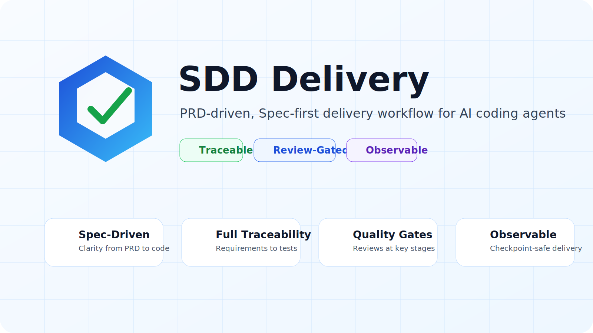
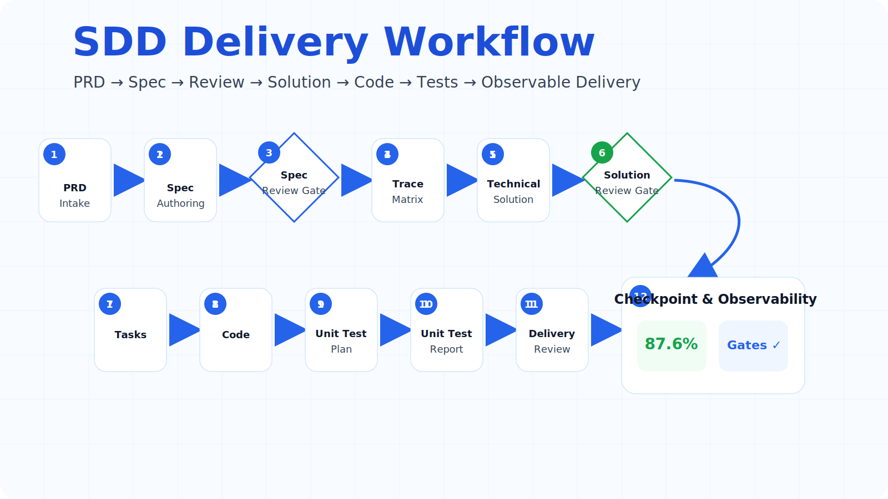
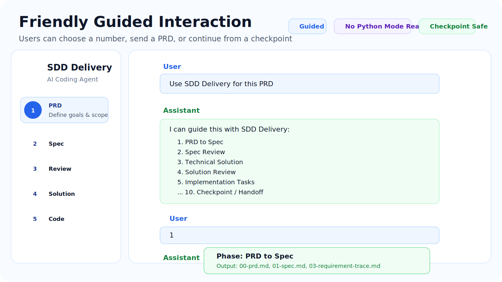

# SDD Delivery Skill

[中文](#中文说明) | [English](#english)

## 中文说明

## Visual Overview

> Add generated images to `assets/images/` using the filenames below. The README will render them automatically on GitHub.

### Hero



`SDD Delivery` is a PRD-driven, Spec-first delivery workflow for AI coding agents. It emphasizes traceability, review gates, and observable delivery.

### Workflow Diagram



The workflow connects every delivery stage:

```text
PRD → Spec → Spec Review → Trace Matrix → Technical Solution → Solution Review → Implementation Tasks → Code → Unit Tests → Delivery Review → Checkpoint & Observability
```

### Friendly Guided Interaction



The skill is designed for guided interaction in Codex and other AI coding clients. Users can send a PRD, choose a number, use quick mode, or continue from a checkpoint.

`SDD Delivery Skill` 是一个面向 AI 编程助手的 Spec-Driven Delivery 技能包，用于把 PRD 转换为可审查的 Spec，再推进到技术方案、方案审查、实现任务、代码实现、单测设计、单测报告、交付审查和可观测 checkpoint。

它适合团队在 Codex / AI coding agent 中推广一套更可靠的研发流程：

```text
PRD → Spec → Spec Review → Trace → Tech Solution → Solution Review → Tasks → Code → Unit Tests → Delivery Review → Checkpoint / Observability
```

### 核心能力

- PRD 自动解析为 Spec 草稿
- Spec 作为 PRD 审查前置规范
- Requirement Trace Matrix 追踪 `PRD → Spec → 方案 → 任务 → 代码 → 单测`
- 技术方案与方案审查 Gate
- 单测计划与单测报告闭环
- 自动计算 Trace 覆盖率
- 从测试文件反查 `SPEC-*` 覆盖情况
- 自动回写 Trace 的单测覆盖列
- 同步 checkpoint 和 observability 面板
- 生成 GitHub PR 模板和 GitHub Actions 校验 workflow
- 支持上下文压缩前的确定性 checkpoint

### 技能包结构

```text
sdd-delivery-skill/
├── SKILL.md
├── agents/
│   └── openai.yaml
├── references/
├── scripts/
└── assets/
    └── templates/
```

### 安装

将 `sdd-delivery-skill` 目录复制到你的 Codex skills 目录，例如：

```bash
cp -R sdd-delivery-skill ~/.codex/skills/sdd-delivery-skill
```

在 Codex 中使用：

```text
Use $sdd-delivery to turn this PRD into Spec, solution, reviewed implementation tasks, unit tests, and observable delivery artifacts.
```

中文也可以：

```text
使用 sdd-delivery，基于这个 PRD 生成 Spec、技术方案、审查清单、实现任务、单测计划和可观测交付产物。
```

### 快速开始

在你的项目根目录执行：

```bash
python path/to/sdd-delivery-skill/scripts/init_artifacts.py login-rate-limit
python path/to/sdd-delivery-skill/scripts/parse_prd_to_spec.py prd.md .sdd-delivery/login-rate-limit --force
python path/to/sdd-delivery-skill/scripts/trace_coverage.py .sdd-delivery/login-rate-limit
python path/to/sdd-delivery-skill/scripts/scan_test_coverage.py . .sdd-delivery/login-rate-limit --update-report --update-trace
python path/to/sdd-delivery-skill/scripts/sync_observability.py .sdd-delivery/login-rate-limit
python path/to/sdd-delivery-skill/scripts/validate_artifacts.py .sdd-delivery/login-rate-limit
```

生成的研发产物位于：

```text
.sdd-delivery/login-rate-limit/
├── 00-prd.md
├── 01-spec.md
├── 02-spec-review.md
├── 03-requirement-trace.md
├── 04-tech-solution.md
├── 05-solution-review.md
├── 06-implementation-tasks.md
├── 07-implementation-log.md
├── 08-unit-test-plan.md
├── 09-unit-test-report.md
├── 10-delivery-review.md
├── 11-checkpoint.json
├── 12-observability.md
└── events.jsonl
```

### 测试文件如何关联 Spec

在测试文件中标注 `SPEC-*`：

```python
def test_login_rate_limit_blocks_after_threshold():
    """Covers SPEC-1 and SPEC-2."""
    assert True
```

然后运行：

```bash
python path/to/sdd-delivery-skill/scripts/scan_test_coverage.py . .sdd-delivery/login-rate-limit --update-report --update-trace
```

脚本会生成：

```text
test-spec-coverage.json
```

并回写：

```text
03-requirement-trace.md
09-unit-test-report.md
11-checkpoint.json
```


### 交互体验设计

这个 Skill 默认采用 guided mode，不要求用户记命令。推荐交互方式：

```text
I can guide this with SDD Delivery:
1. PRD to Spec
2. Spec Review
3. Technical Solution
4. Solution Review
5. Implementation Tasks
6. Code Implementation
7. Unit Test Plan / Report
8. Trace / Coverage
9. GitHub PR / CI Assets
10. Checkpoint / Handoff

Send a PRD, choose a number, or say "quick mode" for a lightweight path.
```

每个阶段建议展示简短 phase card：

```text
Phase: Spec Review
Input: 01-spec.md
Output: 02-spec-review.md
Gate: Spec review must pass before technical solution
Next: fix findings or continue with accepted risk
```

如果用户本地没有 Python，Agent 应直接切换为 No Python Mode，用自然语言和文件编辑完成相同流程。
### 能力菜单

加载技能后，如果用户没有指定阶段，建议先展示能力菜单：

```text
I can run SDD Delivery in these modes:
1. PRD to Spec
2. Spec Review
3. Technical Solution
4. Solution Review
5. Implementation Tasks
6. Code Implementation
7. Unit Test Plan / Report
8. Trace / Coverage
9. GitHub PR / CI Assets
10. Checkpoint / Handoff

Send a PRD or choose a number.
```

### 无 Python 模式

如果用户本地没有 Python，技能不应该直接失败。AI agent 应改用自然语言和文件编辑完成同样流程：

1. 创建 `.sdd-delivery/<feature>/`。
2. 按模板手动创建 Markdown / JSON artifacts。
3. 手动把 PRD 整理成 `00-prd.md` 和 `01-spec.md`。
4. 手动维护 `03-requirement-trace.md`。
5. 手动更新 `11-checkpoint.json` 和 `12-observability.md`。
6. 告知用户哪些自动化脚本被跳过。

### 常用 AI 工具使用

#### Codex

```text
Use $sdd-delivery to turn this PRD into Spec, solution, reviewed implementation tasks, unit tests, and observable delivery artifacts.
```

#### Claude Code

```text
Read sdd-delivery-skill/SKILL.md and follow the SDD Delivery workflow. If Python is unavailable, create and update the artifacts manually.
```

#### Cursor

```text
Follow the SDD Delivery workflow in SKILL.md. Create .sdd-delivery/<feature> artifacts and maintain the requirement trace matrix.
```

#### GitHub Copilot Chat

```text
Review this PR against .sdd-delivery/<feature>/01-spec.md, 03-requirement-trace.md, 04-tech-solution.md, and 09-unit-test-report.md. Findings first.
```


### Plugin 维护说明

如果你把本项目作为 Codex Plugin 发布，推荐仓库根目录使用 plugin 包结构：

```text
sdd-delivery/
├── .codex-plugin/plugin.json
├── README.md
└── skills/sdd-delivery/
```

维护建议：

- 修改 skill 后同步更新 `skills/sdd-delivery/SKILL.md`。
- 用户可见行为变化时更新 README。
- breaking schema 变化时提升 major version。
- 新增脚本或新 artifact 时提升 minor version。
- 文档、小 prompt、模板微调提升 patch version。
- 保持 No Python Mode 可用，脚本只能作为加速器。

更多说明见：`skills/sdd-delivery/references/plugin-operations.md`。

### 参考的开源设计

本项目综合参考了以下公开实践：

- GitHub Spec Kit：Spec-first、阶段化、artifact-first 的 SDD 工作流。
- OpenSpec：面向既有项目的变更规格和 brownfield 友好流程。
- Agent Skill 模式：`SKILL.md` + `references/` + `scripts/` 的渐进加载。
- Context checkpoint 模式：压缩 / 交接前写确定性 checkpoint。
- Requirement Traceability：把需求、Spec、方案、任务、代码、单测串起来。
- GitHub Delivery Practices：PR template、CI artifact validation、review gate。

更多说明见：`skills/sdd-delivery/references/open-source-influences.md`。
### Plugin 安装方式

本仓库同时可以按 Codex Plugin 方式发布。推荐仓库结构：

```text
sdd-delivery/
├── .codex-plugin/plugin.json
└── skills/sdd-delivery/
```

如果你只发布 skill 包，则使用 `sdd-delivery-skill/`；如果你希望用户通过 plugin 安装，则发布 `sdd-delivery/` plugin 包。
### GitHub 集成

生成 PR 模板和 CI 校验：

```bash
python path/to/sdd-delivery-skill/scripts/generate_github_assets.py .
```

会生成：

```text
.github/pull_request_template.md
.github/workflows/sdd-delivery-artifacts.yml
.github/scripts/validate_devflow_artifacts.py
```

### 推荐 GitHub 仓库描述

```text
A Spec-Driven Delivery skill that turns PRDs into reviewed specs, technical solutions, traceable tasks, unit tests, checkpoints, and observable engineering artifacts.
```

---

## English

`SDD Delivery Skill` is a Spec-Driven Delivery skill for AI coding agents. It turns PRDs into reviewable Specs, then guides technical solution design, solution review, implementation tasks, coding, unit test planning, unit test reporting, delivery review, and observable checkpoints.

Recommended workflow:

```text
PRD → Spec → Spec Review → Trace → Tech Solution → Solution Review → Tasks → Code → Unit Tests → Delivery Review → Checkpoint / Observability
```

### Key Features

- Parse PRD markdown into draft Spec artifacts
- Make Spec the mandatory contract before PRD review
- Maintain a requirement trace matrix from PRD to Spec, solution, tasks, code, and tests
- Add technical solution and solution review gates
- Add unit test plan and unit test report artifacts
- Calculate trace coverage automatically
- Reverse-scan test files for `SPEC-*` coverage
- Write test coverage back to the trace matrix
- Sync checkpoint and observability dashboards
- Generate GitHub PR template and GitHub Actions validation workflow
- Support deterministic checkpoints before context compaction or handoff

### Installation

Copy the skill directory into your Codex skills directory:

```bash
cp -R sdd-delivery-skill ~/.codex/skills/sdd-delivery-skill
```

Use it in Codex:

```text
Use $sdd-delivery to turn this PRD into Spec, solution, reviewed implementation tasks, unit tests, and observable delivery artifacts.
```

### Quick Start

From your project root:

```bash
python path/to/sdd-delivery-skill/scripts/init_artifacts.py login-rate-limit
python path/to/sdd-delivery-skill/scripts/parse_prd_to_spec.py prd.md .sdd-delivery/login-rate-limit --force
python path/to/sdd-delivery-skill/scripts/trace_coverage.py .sdd-delivery/login-rate-limit
python path/to/sdd-delivery-skill/scripts/scan_test_coverage.py . .sdd-delivery/login-rate-limit --update-report --update-trace
python path/to/sdd-delivery-skill/scripts/sync_observability.py .sdd-delivery/login-rate-limit
python path/to/sdd-delivery-skill/scripts/validate_artifacts.py .sdd-delivery/login-rate-limit
```

### GitHub Integration

Generate PR and CI assets:

```bash
python path/to/sdd-delivery-skill/scripts/generate_github_assets.py .
```

This creates:

```text
.github/pull_request_template.md
.github/workflows/sdd-delivery-artifacts.yml
.github/scripts/validate_devflow_artifacts.py
```

### License

Choose a license before publishing. MIT is a common default for open-source tooling.


